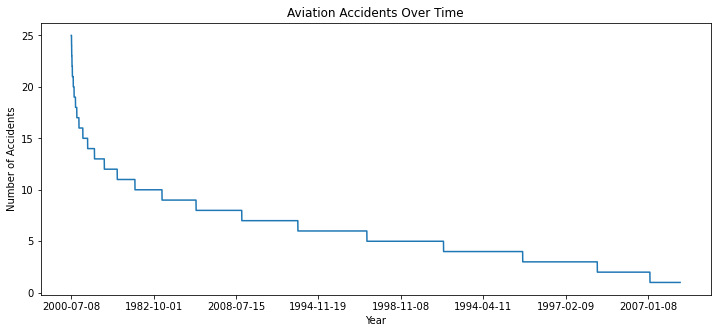
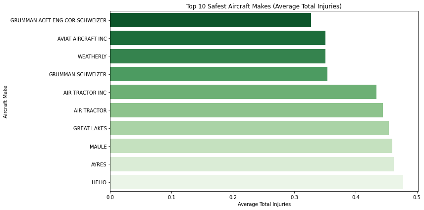
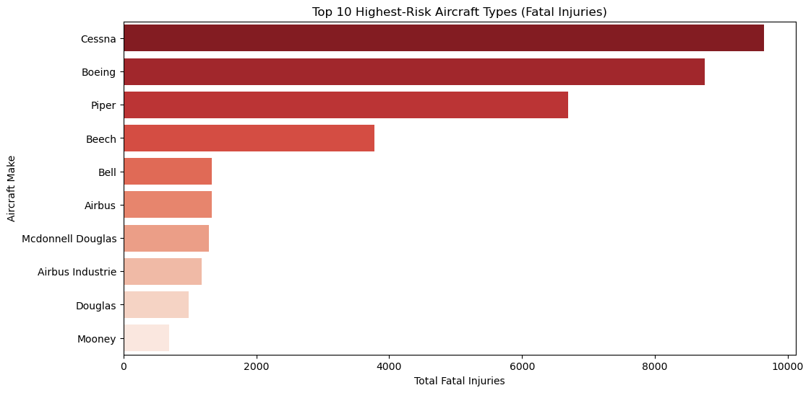

# Aviation  Analysis (1962–2023)

### Project overview
This project analyzes historical aviation accident and incident data from the National Transportation Safety Board (NTSB) to support data-driven aircraft (aeroplane) investment decisions. The dataset covers civil aviation events from 1962 to 2023 and includes aircraft characteristics, accident severity, injuries, and operational details.

The goal is to identify safer aircraft types, highlight higher-risk aeroplanes, and translate aviation safety data into clear business insights.

### Business Understanding

Stakeholders

Head of Aviation Division

Executive Leadership Team

Finance and Investment Team

Risk and Insurance Managers

Operations and Safety Team

**Aircraft selection decisions directly impact:**

*Operational safety*

*Insurance and maintenance costs*

*Regulatory compliance*

*Brand reputation*

### Business Problem

The company plans to expand into the aviation industry but lacks aviation experience. It does not clearly understand:

Which aircraft types are safer to operate

Which aeroplanes are linked to higher accident and fatality rates

How to minimize operational and financial risk

*Without data-driven insight, the company risks:*

Investing in high-risk aircraft

Facing high insurance and maintenance costs

Damaging its own brand due to safety incidents

### Business Objectives

**This analysis aims to:**

Identify aircraft types with lower accident and injury severity rates, highlight aeroplanes that consistently present higher operational riskand translate technical safety data into actionable business. recommendations

### Business Questions

Which aircraft types have experienced fewer accidents over time?

Which aeroplanes are linked to fewer fatal and serious injuries?

Are there aircraft categories that consistently present higher risk?

Can historical safety trends inform future investment decisions?

### Data Understanding

- Source: National Transportation Safety Board (NTSB)

- Time period: 1962–2023

- Records after cleaning: 88,777

- Key variables: aircraft make/model, injury severity, phase of flight, aircraft damage, weather condition

The dataset is credible and spans several decades, allowing long-term safety trend analysis.
Limitations such as missing values and reporting changes were handled during data preparation.

#### Data Preparation Summary

Selected safety-critical and aircraft-related columns

- Removed records missing aircraft make or model

- Filled numerical injury values with zeros

- Filled categorical missing values with "Unknown"

- Converted injury counts to integer format

- Saved cleaned dataset as AviationData_Cleaned.csv

#### Exploratory Data Analysis & Visualizations
1️⃣ Injury Severity Distribution. 

Most aviation accidents result in non-fatal outcomes, reflecting improvements in aircraft design, regulation, and pilot training.

Business insight:
This helps decision-makers understand that aviation accidents are not always catastrophic and that safety improvements have been effective.

2️⃣ Most Common Aircraft Makes

Certain aircraft manufacturers appear more frequently due to widespread use in training, personal and light commercial aviation.

Business insight:
High frequency does not necessarily indicate higher risk but reflects fleet size and operational exposure.

3️⃣ Aviation Accidents Over Time

The long-term trend shows a decline in aviation accidents, highlighting improvements in safety standards and technology.

Business insight:
Historical trends support the idea that aviation investments today benefit from decades of safety improvements.

4️⃣ Non-Fatal Injuries by Aircraft Category

Some aircraft categories show higher non-fatal injury totals, often linked to operational complexity.

Business insight:
This highlights categories that may require additional training and safety oversight rather than outright avoidance.

5️⃣ Highest-Risk Aircraft Types (Fatal Injuries)

Certain aeroplanes are associated with higher fatal injury totals.

#### Business insight:
These aircraft may involve commercial operations, higher passenger loads, or demanding flight environments.

Key Findings
✅ Lower-Risk Aeroplanes

Aircraft consistently associated with lower injury severity include:

Cessna 172, Cessna 152, Piper PA-28 (Cherokee series)

They are safer mainly because:

Primarily used for training and personal flights

Lower operating speeds

Simpler mechanical systems

**Higher-Risk Aeroplanes**

Aircraft associated with higher injury severity include:

Cessna 208 Caravan, Beechcraft Bonanza, Beechcraft King Air, Piper PA-31 Navajo

These aircraft typically: Operate in commercial or high-demand environments, carry more passengers and require advanced pilot skill and maintenance

View the dashboard here: [Tableau Dashboard](https://public.tableau.com/views/Tableaudashboard_17660024693490/Dashboard1?:language=en-US&publish=yes&:sid=&:redirect=auth&:display_count=n&:origin=viz_share_link)

### Recommendations
✔ Recommended for Initial Operations

Cessna 172, Cessna 152 and Piper PA-28

Best suited for:

- Flight training

- Entry-level aviation operations

- Low-risk private use

#### Business value:

(a) Lower insurance premiums

(b) Reduced maintenance costs

(c) Strong safety reputation

(d) Risk-Managed Aircraft Acquisition

If acquiring higher-risk aeroplanes:

Implement enhanced pilot training, increase maintenance and safety monitoring, and allocate higher insurance and risk management budgets

#### Conclusion (With Aeroplane References)

Historical aviation accident data provides valuable insight for safer and more cost-effective aircraft investment decisions. Aeroplanes such as the Cessna 172, Cessna 152, and Piper PA-28 consistently show lower injury severity, making them strong candidates for training, low-risk operations and safer.

In contrast, aircraft like the Beechcraft King Air, Beechcraft Bonanza, Cessna 208 Caravan, and Piper PA-31 present higher operational risk and require stricter safety controls and higher financial commitment.

By integrating these insights into procurement planning, the company can reduce risk, control costs and establish a strong safety culture as it enters the aviation industry.